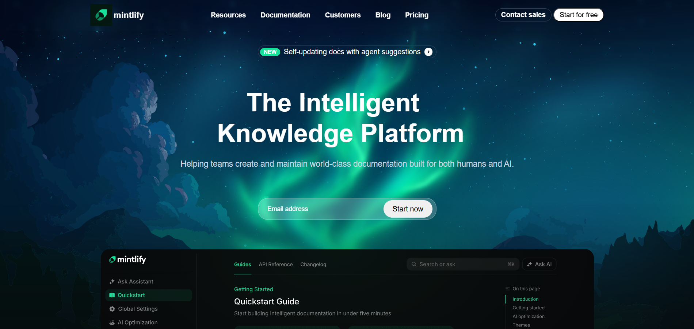

# Mintlify Landing Page Clone 🌿

A **desktop-first landing page clone inspired by Mintlify**, built using **HTML & CSS**.  
This project focuses on clean UI, modern layouts, gradients, and structured sections similar to real-world SaaS websites.

---

## 🚀 Live Demo

🔗 **Live Site:**  
https://fluffy-zuccutto-bd364e.netlify.app/

---

## 📌 Features

- Modern **Navbar layout**
- Dark-themed **hero & enterprise section**
- Mintlify-style **Enterprise Reinvention section**
- Premium **Customer Story gradient card**
- Clean typography & spacing
- Desktop-first design (not responsive)

---

## 🧱 Sections Included

### 1. Navigation Bar
- Logo + brand name
- Resource links
- CTA buttons (Contact Sales / Start for Free)

### 2. Enterprise Reinvention Section
- Tag-based heading
- Enterprise-focused CTA
- Feature grid with icons and descriptions

### 3. Customer Story Section (Mintlify Inspired)
- Gradient background with rounded corners
- Customer story headline
- Call-to-action link
- Key stats (Monthly developers, products serviced)
- Illustration-based layout

---

## 🛠 Tech Stack

- **HTML5**
- **CSS3**
- Flexbox & Grid
- Desktop-first approach

---

## 📂 Project Structure
```
Mintlify-Clone/
│
├── index.html
├── style.css
├── assets/
│ ├── images/
│ └── fonts/
└── README.md
```

---

## ⚠️ Important Note

> This website is **desktop-first only** and **not responsive** yet.  
Responsiveness will be added in future iterations.

---

## 🎯 Purpose of This Project

- Practice real-world UI cloning
- Improve layout & spacing skills
- Understand SaaS landing page structure
- Build portfolio-ready frontend projects

---

## 📸 Preview



## 📬 Feedback

Feel free to share feedback or suggestions to improve this project.  
This clone is built **for learning and practice purposes only**.

---

### ⭐ If you like this project, give it a star!
